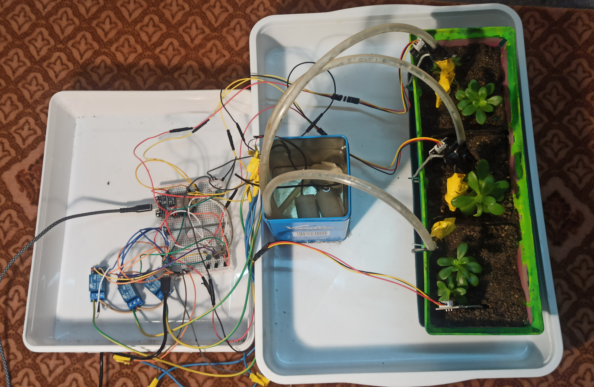
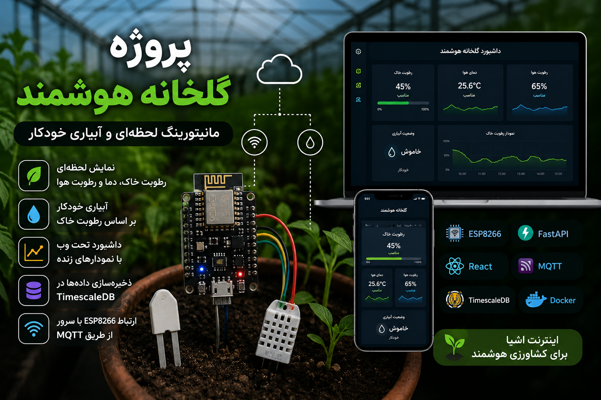
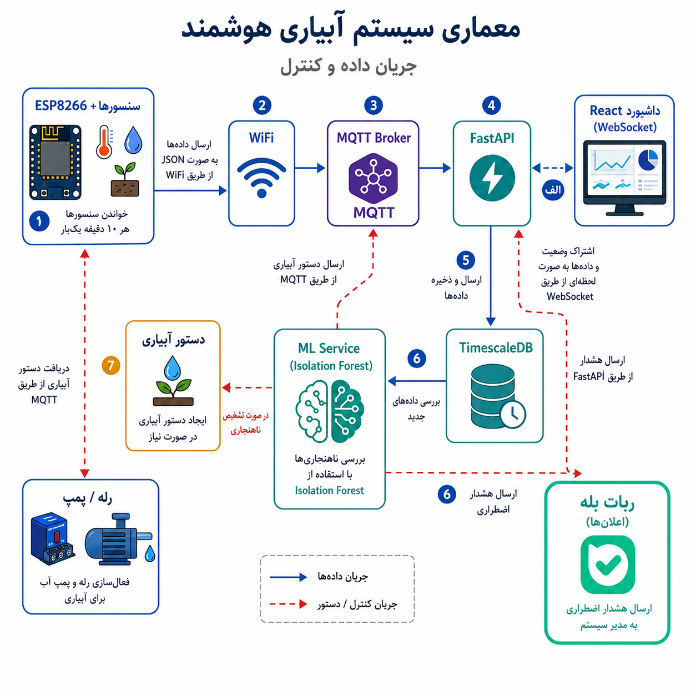
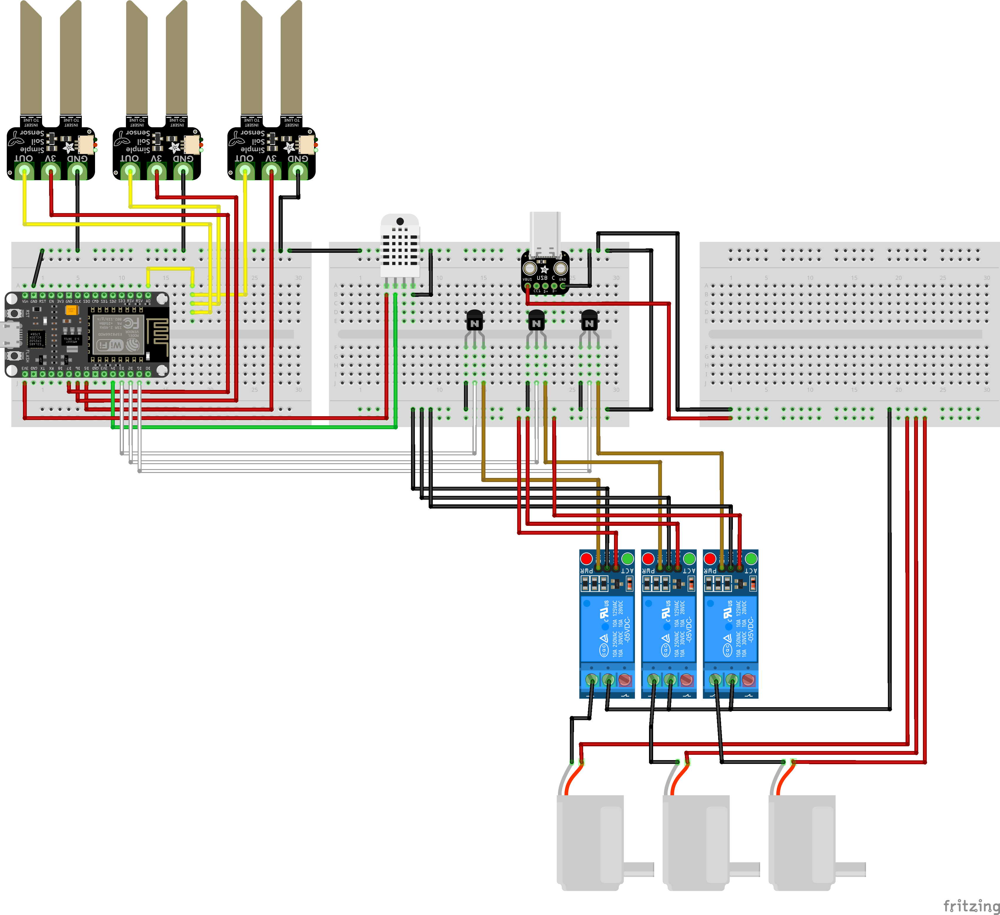
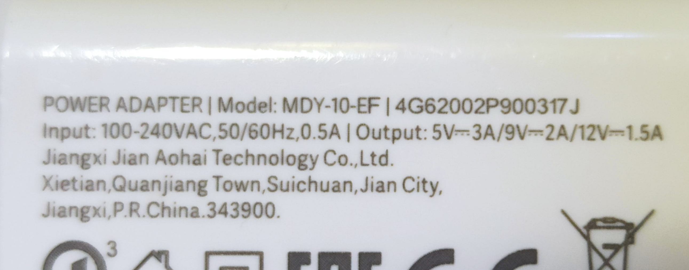
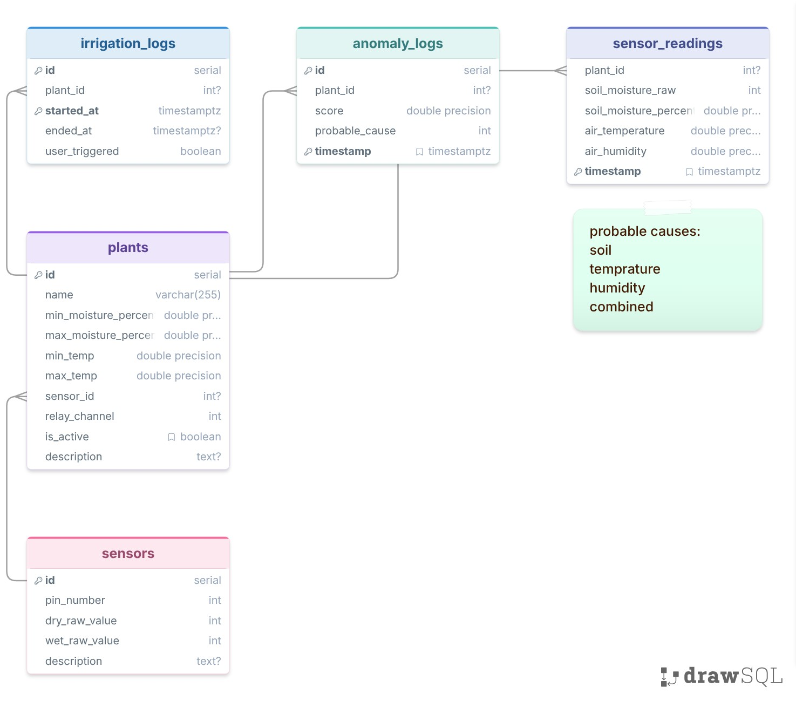
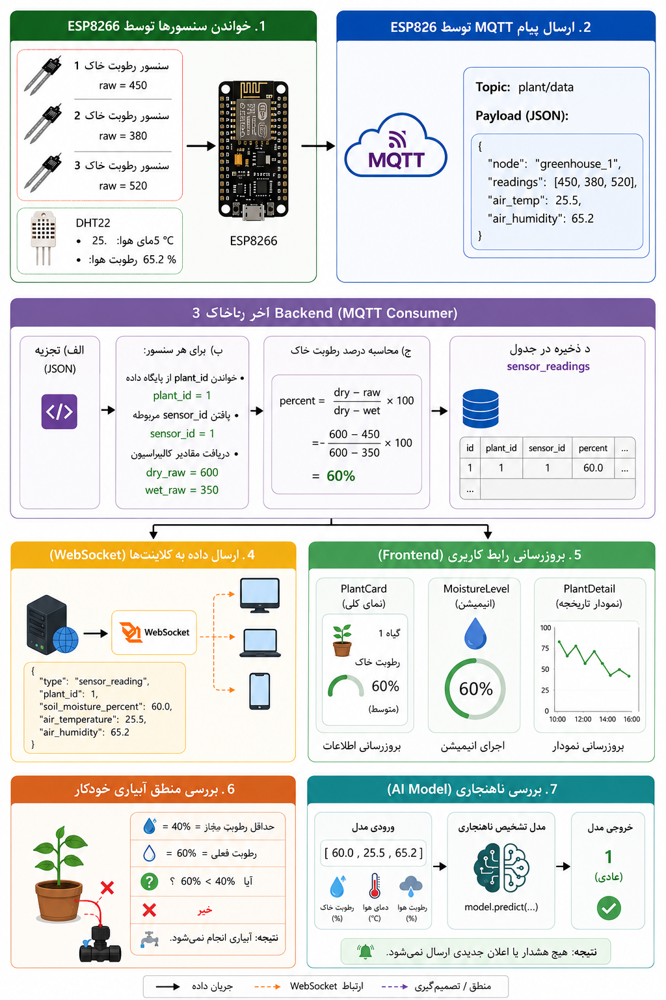
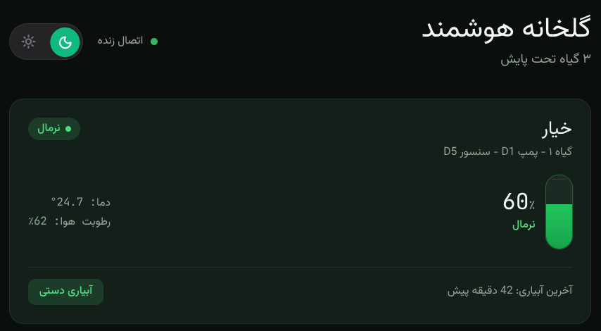

<h1 style="color: #15b10d;">سیستم هوشمند آبیاری با تشخیص وضعیت گیاه</h1>
<h2 style="color: #3ff427;">مبتنی بر IoT و یادگیری ماشین</h2>

پروژه دانشگاهی درس اینترنت اشیا (IoT) برای پیاده سازی گلخانه هوشمند با تکنولوژی های :


<p align="center">
  <a href="https://fastapi.tiangolo.com/" target="_blank"></a>
  <a href="https://www.docker.com/" target="_blank"></a>
  <a href="https://www.postgresql.org" target="_blank"></a>
  <a href="https://git-scm.com/" target="_blank"></a>
  <a href="https://react.dev/" target="_blank"></a>
  <a href="https://www.sqlalchemy.org/" target="_blank"></a>
  <a href="https://mqtt.org/" target="_blank"></a>
  <a href="http://scikit-learn.org/" target="_blank"></a>
</p>


---

## فهرست مطالب

0. [ویدیو پروژه](#video-report)
1. [نمای کلی پروژه](#section-1)
2. [معماری سیستم](#section-2)
3. [سخت‌افزار (Firmware)](#section-3)
4. [پروتکل ارتباطی MQTT](#section-4)
5. [دیتابیس و مدل‌های داده](#section-5)
6. [بک‌اند (Backend API)](#section-6)
7. [منطق آبیاری خودکار](#section-7)
8. [سرویس یادگیری ماشین (Anomaly Detection)](#section-8)
9. [سیستم اعلان‌ها (Bale Messenger)](#section-9)
10. [گزارش روزانه خودکار](#section-10)
11. [فرانت‌اند (Dashboard)](#section-11)
12. [زیرساخت Docker](#section-12)
13. [جریان داده کامل (از سنسور تا داشبورد)](#section-13)
14. [طراحی API و endpointها](#section-14)
15. [نحوه اجرا](#section-15)
16. [دموی داشبورد پروژه](#section-demo)

---

<a id="video-report"></a>
## ویدیوی توضیح پروژه
برای مشاهده ویدیو، روی تصویر زیر کلیک کنید:

[](https://youtu.be/BbICIG6-ets)
[لینک ویدیوی آپارات](https://aparat.com/v/riupap0)

---
<a id="section-1"></a>
## 1. نمای کلی پروژه

این پروژه یک سیستم **گلخانه هوشمند** است که شامل چندین جزء اصلی است:

- **سخت‌افزار**: میکروکنترلر ESP8266 با سنسور رطوبت خاک (Capacitive) و سنسور دما و رطوبت هوا (DHT22)
- **بک‌اند**: سرور FastAPI (Python) با پایگاه داده TimescaleDB
- **فرانت‌اند**: داشبورد React با قابلیت PWA
- **ارتباطات**: پروتکل MQTT برای ارتباط سخت‌افزار و سرور
- **یادگیری ماشین**: مدل Isolation Forest برای تشخیص ناهنجاری
- **اعلان‌ها**: ربات Bale Messenger برای ارسال هشدارها و گزارش‌ها

**هدف پروژه**: مانیتورینگ لحظه‌ای وضعیت گیاهان، آبیاری خودکار بر اساس رطوبت خاک، و تشخیص ناهنجاری‌های محیطی با استفاده از یادگیری ماشین.

---

<a id="section-2"></a>
## 2. معماری سیستم


### دلیل این معماری:

1. **جداسازی نگرانی‌ها (Separation of Concerns)**: هر جزء یک مسئولیت مشخص دارد
2. **مقیاس‌پذیری**: با اضافه کردن ESPهای بیشتر، فقط تاپیک MQTT و دیتابیس رشد می‌کند
3. **انعطاف‌پذیری**: فرانت اند مستقل از سخت‌افزار است - هر تغییر UI نیازی به تغییر firmware ندارد
4. **قابلیت اطمینان**: MQTT یک پروتکل سبک و قابل اعتماد برای IoT است

---

<a id="section-3"></a>
## 3. سخت‌افزار (Firmware)

### فایل: `firmware/greenhouse_firmware.ino`

### میکروکنترلر: ESP8266 (NodeMCU 1.0)

#### سنسورها:

| سنسور | پین | نوع | توضیح |
|-------|-----|------|-------|
| رطوبت خاک ۱ | D5 (VCC), A0 (ANALOG) | Capacitive Soil Moisture | خواندن از طریق MUX |
| رطوبت خاک ۲ | D6 (VCC), A0 (ANALOG) | Capacitive Soil Moisture | خواندن از طریق MUX |
| رطوبت خاک ۳ | D7 (VCC), A0 (ANALOG) | Capacitive Soil Moisture | خواندن از طریق MUX |
| دما و رطوبت هوا | D4 | DHT22 | دمای هوا + رطوبت هوا |

#### ترانزیستور 2N3904 از نوع NPN:

| ترانزیستور | Base | Emitter | Collector |
|-----|-----|-------|-------|
| ترانزیستور ۱ | D0 | GND | IN Relay 1 |
| ترانزیستور ۲ | D1 | GND | IN Relay 2 |
| ترانزیستور ۳ | D2 | GND | IN Relay 3 |

#### رله‌ها (actuator‌ها):

| رله | پین | کنترل |
|-----|-----|-------|
| پمپ گیاه ۱ | Collector transistor 1 | RELAY_ON = LOW, RELAY_OFF = HIGH |
| پمپ گیاه ۲ | Collector transistor 2 | RELAY_ON = LOW, RELAY_OFF = HIGH |
| پمپ گیاه ۳ | Collector transistor 3 | RELAY_ON = LOW, RELAY_OFF = HIGH |

#### دلیل انتخاب این سخت‌افزار:

1. **ESP8266**: ارزان، WiFi داخلی، کافی برای پروژه‌های IoT ساده
2. **سنسورهای Capacitive**: مقاوم در برابر خوردگی (برخلاف resistive)، عمر طولانی‌تر
1. **DHT22**: دقت بالاتر نسبت به DHT11، قیمت مناسب

#### طراحی سیستم:


ماژول رله به عنوان سوییچ عمل میکند،در این پروژه سیم VCC پمپ ها مستقیما به VCC به بریک اوت وصل شده و گراند پمپ ها به خروجی رله وصل میشوند.
نکته: همه گراند ها باید مشترک باشند تا سیگنال مشترکی داشته باشند
نکته: برای ESP82 از آداپتور۵ ولت با جریان ۵۵۰ میلی آمپر و برای پمپ ها،آداپتور ۵ ولت با حریان ۳ آمپر  از طریق بریک اوت متصل هستند.
نکته: حتما قبل اتصال به برق حریان آداپتور را بررسی کنید تا باعث سوختن قطعه نشوید
نکته: اگر کابل fast-charge به بریک اوت وصل کنید احتمالا باید با سیگنال های D+ , D- روی بریک اوت هم کار کنید پس سعی کنید که از این نوع کابل ها استفاده نکنید

<table>
  <tr>
    <td align="center">
      
      <br>
      esp used adapter
    </td>
    <td align="center">
      
      <br>
      pumps used adapter
    </td>
  </tr>
</table>


### منطق خواندن سنسور خاک:

```cpp
int readSoilSensor(int vccPin) {
  digitalWrite(vccPin, HIGH);   // روشن کردن سنسور
  delay(50);                     // صبر برای پایدار شدن خروجی
  int rawValue = analogRead(SOIL_ANALOG_PIN);  // خواندن مقدار خام ADC
  digitalWrite(vccPin, LOW);    // خاموش کردن سنسور
  return rawValue;
}
```

**دلیل این روش**: سنسورهای خاک به صورت مشترک از یک پین آنالوگ (A0) استفاده می‌کنند. با روشن/خاموش کردن VCC هر سنسور به نوبت، می‌توانیم هر سه را با یک پین آنالوگ بخوانیم (Multiplexing نرم‌افزاری).

### فرمت پیام MQTT ارسالی:

```json
{
  "node": "greenhouse_1",
  "readings": [
    {"plant_id": 1, "soil_raw": 450},
    {"plant_id": 2, "soil_raw": 380},
    {"plant_id": 3, "soil_raw": 520}
  ],
  "air_temp": 25.5,
  "air_humidity": 65.2
}
```

**دلیل این فرمت**: به جای ارسال سه پیام جداگانه (برای هر گیاه)، یک پیام واحد با آرایه readings ارسال می‌شود. این کار:
- ترافیک شبکه را کاهش می‌دهد
- پردازش بک‌اند را ساده‌تر می‌کند
- دمای هوا و رطوبت هوا فقط یک بار خوانده می‌شود (مشترک بین همه گیاهان)

---
<a id="section-4"></a>
## 4. پروتکل ارتباطی MQTT

### چرا MQTT؟

| ویژگی | MQTT | HTTP | WebSocket |
|-------|------|------|-----------|
| سبکی | خیلی سبک (2 byte header) | سنگین (headers) | متوسط |
| Push/Push | بله | فقط Pull | بله |
| QoS | پشتیبانی می‌کند | ندارد | ندارد |
| قطع اتصال | تحمل می‌کند | خطا می‌دهد | خطا می‌دهد |
| مناسب IoT | بله | خیر | خیر |

### تنظیمات Mosquitto:

```yaml
# docker-compose.yml
mqtt5:
  image: eclipse-mosquitto
  ports:
    - "1883:1883"   # MQTT
    - "9001:9001"   # WebSocket (برای دیباگ)
```

### تاپیک‌ها:

| تاپیک | جهت | محتوا |
|-------|------|-------|
| `plant/data` | ESP → Backend | خوانش سنسورها (JSON) |
| `plant/command` | Backend → ESP | دستور آبیاری/توقف (JSON) |

**دلیل استفاده از یک تاپیک به جای چند تاپیک**: plant_id داخل payload قرار دارد، نه در topic. این کار:
- مدیریت subscription را ساده‌تر می‌کند (backend فقط یک topic را subscribe می‌کند)
- اضافه کردن گیاه جدید نیازی به تغییر subscription ندارد

---

<a id="section-5"></a>
## 5. دیتابیس و مدل‌های داده

### فناوری: TimescaleDB

**TimescaleDB** یک افزونه PostgreSQL است که برای داده‌های سری زمانی (Time Series) بهینه شده است.

**دلیل انتخاب TimescaleDB**:
1. **Hypertable**: جداول را به صورت خودکار بر اساس زمان پارتیشن‌بندی می‌کند
2. **کاملاً سازگار با PostgreSQL**: می‌توان از تمام قابلیت‌های PostgreSQL استفاده کرد
3. **عملکرد بالا**: برای queryهای مبتنی بر زمان بهینه شده

### ساختار جداول:

#### جدول `sensors` (سخت‌افزار)

```sql
CREATE TABLE sensors (
    id SERIAL PRIMARY KEY,
    pin_number INTEGER NOT NULL,        
    dry_raw_value INTEGER NOT NULL, 
    wet_raw_value INTEGER NOT NULL,
    description TEXT
);
```

**دلیل `dry_raw_value` و `wet_raw_value`**: سنسورهای Capacitive خاک مقدار خام ADC برمی‌گردانند (نه درصد). برای تبدیل به درصد، به دو نقطه Calibration نیاز داریم:
- `dry_raw_value`: مقداری که سنسور در هوای آزاد (خاک خشک) برمی‌گرداند
- `wet_raw_value`: مقداری که سنسور در آب (خاک کاملاً مرطوب) برمی‌گرداند

نکته: برای پیدا کردن dry_value و wet_value ،یک بار برای چند دقیقه سنسور را در هوای آزاد قرار داده و یکبار در خاک بسیار مرطوب برای چند دقیقه قرار داده و در هر کدام از این مراحل مقادیر سنسور را از طریق serial_monitor درون arduino_ide بدست آورده و با میانگین گیری هر کدام از مقادیر را بدست آورده

نکته: حدالامکان از قرار دادن سنسور جلو باد سشوار، یا قرار دادن در آب خالص جلوگیری کنید چون ممکن است سنسور بسوزد یا بخش خازنی آن مشکل پیدا کند.

فرمول تبدیل:
```python
percent = (dry_value - raw_value) / (dry_value - wet_value) * 100
```

**محدوده مقادیر خام**: سنسورهای Capacitive مقادیر معکوس برمی‌گردانند:
- خشک → مقدار بالا (مثلاً 600-800)
- مرطوب → مقدار پایین (مثلاً 300-400)

#### جدول `plants` (مرکزی)

```sql
CREATE TABLE plants (
    id SERIAL PRIMARY KEY,
    name VARCHAR(255) NOT NULL,
    min_moisture_percent FLOAT NOT NULL,  -- حداقل رطوبت مجاز
    max_moisture_percent FLOAT NOT NULL,  -- حداکثر رطوبت مجاز
    min_temp FLOAT NOT NULL,              -- حداقل دمای مجاز
    max_temp FLOAT NOT NULL,              -- حداکثر دمای مجاز
    sensor_id INTEGER REFERENCES sensors(id),  -- FK به سنسور
    relay_channel INTEGER NOT NULL,       -- شماره کانال رله
    is_active BOOLEAN NOT NULL DEFAULT TRUE,
    description TEXT
);
```

**دلیل وجود آستانه‌ها (Thresholds)**:
- هر گیاه نیازهای متفاوتی دارد (خیار با گوجه فرق دارد)
- سیستم باید بداند چه زمانی رطوبت "کم" یا "زیاد" است
- کاربر می‌تواند از طریق داشبورد این مقادیر را تغییر دهد

**دلیل `sensor_id` به جای آدرس مستقیم سنسور**: جداسازی سخت‌افزار و نرم‌افزار. اگر سنسور خراب شود، فقط کافی است `sensor_id` را در جدول plants تغییر دهیم، نه firmware را.

#### جدول `sensor_readings` (سری زمانی)

```sql
CREATE TABLE sensor_readings (
    plant_id INTEGER REFERENCES plants(id) ON DELETE SET NULL,
    soil_moisture_raw INTEGER NOT NULL,
    soil_moisture_percent FLOAT NOT NULL,
    air_temperature FLOAT NOT NULL,
    air_humidity FLOAT NOT NULL,
    timestamp TIMESTAMPTZ NOT NULL DEFAULT NOW()
);
```

**نکته مهم**: این جدول **هیچ `id` یا primary key خودکار ندارد**! فقط `timestamp` به عنوان بخشی از PK عمل می‌کند.

**دلیل نداشتن `id`**:
1. **Performance**: جداول TimescaleDB (Hypertable) بدون `id` خودکار بهتر عمل می‌کنند
2. **Partitioning**: TimescaleDB بر اساس زمان پارتیشن‌بندی می‌کند، `id` خودکار به این فرآیند آسیب می‌زند
3. **Volume**: این جدول هر ۱۰ ثانیه یک ردیف اضافه می‌کند - در طول روز ~8640 ردیف، در ماه ~260K ردیف
4. **Query Pattern**: هیچوقت یک ردیف خاص را با ID جستجو نمی‌کنیم، فقط بازه‌های زمانی را query می‌کنیم

**دلیل `ON DELETE SET NULL`**: اگر گیاهی حذف شود، داده‌های تاریخی پاک نمی‌شوند - فقط `plant_id` آن‌ها NULL می‌شود. این برای سیستم‌های IoT حیاتی است چون داده‌های تاریخی ارزشمند هستند.

#### جدول `irrigation_logs`

```sql
CREATE TABLE irrigation_logs (
    id SERIAL,
    plant_id INTEGER REFERENCES plants(id) ON DELETE SET NULL,
    started_at TIMESTAMPTZ NOT NULL,
    ended_at TIMESTAMPTZ,
    user_triggered BOOLEAN NOT NULL DEFAULT FALSE,
    PRIMARY KEY (id, started_at)
);
```

**دلیل ترکیب `id` + `started_at` به عنوان PK**:
1. `id` برای شناسایی منحصربفرد هر رویداد آبیاری
2. `started_at` برای پارتیشن‌بندی TimescaleDB و queryهای مبتنی بر زمان
3. حجم داده کم (روزی چند ردیف)، بنابراین `id` آسیبی به عملکرد نمی‌زند

**دلیل `user_triggered`**: تمایز بین آبیاری خودکار (توسط سیستم) و دستی (توسط کاربر). این اطلاعات برای تحلیل عملکرد سیستم مفید است.

#### جدول `anomaly_logs`

```sql
CREATE TABLE anomaly_logs (
    id SERIAL,
    plant_id INTEGER REFERENCES plants(id) ON DELETE SET NULL,
    score FLOAT NOT NULL,
    probable_cause probable_cause_enum NOT NULL,
    timestamp TIMESTAMPTZ NOT NULL DEFAULT NOW(),
    PRIMARY KEY (id, timestamp)
);
```

**دلیل وجود `score`**: مدل Isolation Forest یک عدد (score) برمی‌گرداند که نشان می‌دهد نقطه چقدر "غیرعادی" است. هرچه score منفی‌تر، ناهنجاری شدیدتر.

**دلیل enum `probable_cause`**: مدل ML فقط می‌گوید "غیرعادی است" اما نمی‌گوید "چرا". تابع `determine_probable_cause()` با بررسی قوانین ساده علت احتمالی را مشخص می‌کند.

### تبدیل مقادیر خام به درصد:

```python
def calculate_moisture_percent(raw_value: int, dry_value: int, wet_value: int) -> float:
    percent = (dry_value - raw_value) / (dry_value - wet_value) * 100
    return max(0.0, min(100.0, percent))
```

**مثال**:
- `dry_value = 600`, `wet_value = 350`
- اگر `raw_value = 450`: `(600 - 450) / (600 - 350) * 100 = 60%`
- `max(0, min(100, 60)) = 60%`

**دلیل clamp کردن**: ممکن است به دلیل نویز یا خرابی سنسور، مقدار خارج از محدوده 0-100 برگردد.

---

<a id="section-6"></a>
## 6. بک‌اند (Backend API)

### ساختار فایل‌های بک‌اند:

```
backend/app/
├── main.py                 
├── database.py             
├── models.py           
├── schemas.py               
├── crud.py                  
├── connection_manager.py    
├── irrigation_logic.py      
├── notifier.py              
├── mqtt_publisher.py        
├── daily_report.py          
├── routers/
│   ├── plants.py            
│   └── sensors.py           
└── ml_service/
    ├── train.py             
    ├── predict.py           
    ├── model_store.py       
    ├── synthetic_data.py    
    └── auto_trainer.py      
```

### Lifecycle اپلیکیشن:

```python
@asynccontextmanager
async def lifespan(app: FastAPI):
    mqtt_task = asyncio.create_task(mqtt_listener())      # listen to MQTT
    train_task = asyncio.create_task(auto_train_loop())    # ML train loop
    report_task = asyncio.create_task(daily_report_loop()) # daily report loop
    yield
    # canceling the loops after deactivation
    for task in (mqtt_task, train_task, report_task):
        task.cancel()
```

**دلیل استفاده از `asyncio.create_task`**: هر سه حلقه به صورت موازی و غیر-blocking اجرا می‌شوند. اگر از `await` معمولی استفاده می‌شد، فقط یکی از آن‌ها اجرا می‌شد.

---

<a id="section-7"></a>
## 7. منطق آبیاری خودکار

### فایل: `irrigation_logic.py`

```python
def should_irrigate(soil_percent: float, min_moisture_percent: float, max_moisture_percent: float) -> bool:
    if soil_percent > max_moisture_percent:
        return False  # Soil is too wet, do not irrigate
    return soil_percent < min_moisture_percent

def calculate_irrigation_duration(soil_percent: float, min_moisture_percent: float) -> int:
    deficit = max(0.0, min_moisture_percent - soil_percent)
    duration = MIN_IRRIGATION_SECONDS + deficit * 0.5
    return int(min(MAX_IRRIGATION_SECONDS, duration))
```

### پارامترها:

| پarameter | مقدار | دلیل |
|-----------|-------|------|
| `MIN_IRRIGATION_SECONDS` | 3 | حداقل زمان آبیاری (پمپ نیاز به زمان برای روشن شدن دارد) |
| `MAX_IRRIGATION_SECONDS` | 12 | حداکثر زمان (جلوگیری از آبیاری بیش از حد) |
| ضریب | 0.5 | برای هر ۱٪ کمبود، ۰.۵ ثانیه اضافه می‌شود |

### مثال:

اگر `min_moisture = 40%` و `soil_percent = 25%`:
- `deficit = 40 - 25 = 15`
- `duration = 3 + 15 * 0.5 = 10.5`
- `min(12, 10.5) = 10 ثانیه`

**دلیل استفاده از رابطه خطی**: ساده و قابل فهم. در آینده می‌توان آن را با داده‌های واقعی calibration کرد.

### فرآیند کامل آبیاری:

```
1. ESP خوانش سنسور را ارسال می‌کند
2. Backend مقدار خام را به درصد تبدیل می‌کند
3. اگر درصد < حداقل:
   a. محاسبه مدت زمان آبیاری
   b. ذخیره لاگ آبیاری
   c. انتشار دستور از طریق MQTT
4. ESP دستور را دریافت می‌کند
5. ESP پمپ را روشن می‌کند
6. ESP بعد از مدت زمان مشخص، پمپ را خاموش می‌کند
```

---

<a id="section-8"></a>
## 8. سرویس یادگیری ماشین (Anomaly Detection)

### الگوریتم: Isolation Forest

**چرا Isolation Forest؟**

| ویژگی | Isolation Forest | SVM | Neural Network |
|-------|------------------|-----|----------------|
| نیاز به داده لیبل‌دار | خیر | بله | بله |
| سرعت آموزش | سریع | کند | خیلی کند |
| پیچیدگی | ساده | متوسط | پیچیده |
| مناسب برای Anomaly Detection | بله | خیر (نیاز به نرمالالیزیشن) | بله |
| نیاز به GPU | خیر | خیر | بله |

**Isolation Forest چگونه کار می‌کند**:
1. داده‌ها را به صورت تصادفی تقسیم می‌کند
2. نقاط غیرعادی زودتر "ایزوله" می‌شوند (شاخه کمتری نیاز دارند)
3. نقاط عادی دیرتر ایزوله می‌شوند (شاخه بیشتری نیاز دارند)

### تنظیمات مدل:

```python
model = IsolationForest(
    contamination=0.05,   # ۵٪ داده‌ها غیرعادی فرض شوند
    random_state=42,      # برای تکرارپذیری
    n_estimators=100,     # تعداد درخت‌ها
)
```

**دلیل `contamination=0.05`**: چون داده‌های آموزشی تا حد ممکن فقط رفتار عادی را شامل می‌شوند، فقط ۵٪ از داده‌ها را غیرعادی فرض می‌کنیم. اگر این مقدار بالاتر باشد، مدل حساس‌تر می‌شود و False Positive بیشتری تولید می‌کند.

### فرآیند آموزش:

```python
# ورودی: آرای numpy با شکل (n, 3)
# ستون‌ها: [soil_moisture_percent, air_temperature, air_humidity]
readings = np.array([
    [45.2, 25.3, 65.1],
    [42.8, 24.9, 63.8],
    ...
])
model = IsolationForest(contamination=0.05)
model.fit(readings)
```

**چرا فقط ۳ ویژگی؟**
1. **رطوبت خاک**: مهم‌ترین عامل برای آبیاری
2. **دما**: تأثیر مستقیم بر تبخیر آب و نیاز گیاه
3. **رطوبت هوا**: تأثیر بر تبخیر و استرس گیاه

**چرا `plant_id` ورودی نیست؟** چون هر گیاه مدل جداگانه دارد. مدل فقط رفتار عادی "آن گیاه خاص" را یاد می‌گیرد.

### پیش‌بینی:

```python
prediction = model.predict(point)  # 1 = عادی, -1 = غیرعادی
score = model.decision_function(point)  # عدد منفی‌تر = غیرعادی‌تر
```

### تشخیص علت احتمالی:

```python
def determine_probable_cause(soil_percent, air_temp, air_humidity,
                              min_moisture, max_moisture, min_temp, max_temp):
    soil_off = soil_percent < min_moisture or soil_percent > max_moisture
    temp_off = air_temp < min_temp or air_temp > max_temp

    if soil_off and temp_off:
        return "combined"
    if soil_off:
        return "soil"
    if temp_off:
        return "temperature"
    return "humidity"
```

**دلیل این منطق ساده**: مدل ML فقط "غیرعادی بودن" را تشخیص می‌دهد، نه "علت" را. با بررسی قوانین ساده (آیا مقدار خارج از محدوده است؟) علت احتمالی را مشخص می‌کنیم.

### ذخیره مدل:

هر گیاه یک مدل جداگانه دارد:
```
ml_models/
├── model_plant_1.joblib          # مدل گیاه ۱
├── model_plant_1_meta.json       # متادیتای مدل ۱
├── model_plant_2.joblib          # مدل گیاه ۲
├── model_plant_2_meta.json       # متادیتای مدل ۲
├── model_plant_3.joblib          # مدل گیاه ۳
└── model_plant_3_meta.json       # متادیتای مدل ۳
```

**متادیتای ذخیره شده**:
```json
{
  "plant_id": 1,
  "trained_at": "2025-07-10T12:00:00+00:00",
  "sample_count": 500,
  "is_synthetic": false
}
```

**دلیل جدا کردن متادیتا از مدل**: خواندن یک فایل JSON کوچک خیلی سریع‌تر از deserialization یک مدل joblib است. فقط وقتی نیاز به پیش‌بینی داریم، مدل را بارگذاری می‌کنیم.

### سیاست بازآموزش (Retraining):

```python
MIN_SAMPLES_FOR_TRAINING = 200
RETRAIN_INTERVAL_DAYS = 4
```

| شرط | عمل |
|-----|-----|
| مدلی وجود ندارد + ≥200 خوانش واقعی | آموزش اولیه |
| مدل مصنوعی است + ≥200 خوانش واقعی | جایگزینی فوری |
| مدل واقعی است + ۴ روز گذشته | بازآموزش با تمام داده‌ها |
| < 200 خوانش | صبر کردن |

**دلیل ۲۰۰ نمونه حداقلی**: Isolation Forest حداقل به این تعداد نیاز دارد تا الگوهای عادی را به خوبی یاد بگیرد. با داده کمتر، مدل بی‌معنی است.

**دلیل ۴ روز بازآموزش**: رفتار گیاه ممکن است با فصل، سن گیاه، یا شرایط محیطی تغییر کند. بازآموزش دوره‌ای مدل را به‌روز نگه می‌دارد.

---

<a id="section-9"></a>
## 9. سیستم اعلان‌ها (Bale Messenger)

### فایل: `notifier.py`

```python
BALE_API_URL = f"https://tapi.bale.ai/bot{BALE_BOT_TOKEN}/sendMessage"

async def send_bale_alert(text: str) -> bool:
    try:
        async with httpx.AsyncClient(timeout=10.0) as client:
            response = await client.post(BALE_API_URL, json=payload)
            response.raise_for_status()
            return True
    except httpx.HTTPError as e:
        print(f"Failed to send Bale alert: {e}")
        return False
```

### چرا Bale؟

Bale یک پیام‌رسان ایرانی است که API سازگار با Telegram دارد. برای کاربران ایرانی مناسب‌تر از Telegram است (دسترسی آسان‌تر).

### انواع اعلان‌ها:

1. **ناهنجاری**: هنگام تشخیص ناهنجاری توسط مدل ML
2. **گزارش روزانه**: هر شب ساعت ۲۲:۰۰ به وقت ایران

### Cooldown برای اعلان‌ها:

```python
ALERT_COOLDOWN_SECONDS = 30 * 60  # ۳۰ دقیقه
```

**دلیل Cooldown**: اگر ناهنجاری ساعت‌ها ادامه داشته باشد، بدون cooldown هر ۱۰ ثانیه یک پیام ارسال می‌شد. ۳۰ دقیقه تعادل مناسبی بین آگاهی کاربر و spam نکردن است.

---

<a id="section-10"></a>
## 10. گزارش روزانه خودکار

### فایل: `daily_report.py`

### زمان ارسال: ساعت ۲۲:۰۰ به وقت ایران (۱۹:۰۰ UTC)

**محاسبه ساعت**:
- ایران UTC+3:30 (نصف‌روز)
- تابستان: UTC+4:30 → ۲۲:۰۰ ایران = ۱۷:۳۰ UTC
- زمستان: UTC+3:30 → ۲۲:۰۰ ایران = ۱۸:۳۰ UTC
- کد از UTC+3:30 استفاده می‌کند (۱۹:۰۰ UTC) - برای پوشش هر دو حالت

### محتوای گزارش:

```
📊 گزارش روزانه — 2025/07/10
────────────────────────────
✅ خیار
   💧 میانگین رطوبت: 45.2%
   🚿 آبیاری: 3 بار
   🔔 ناهنجاری: 0 مورد

⚠️ گوجه
   💧 میانگین رطوبت: 28.7%
   🚿 آبیاری: 8 بار
   🔔 ناهنجاری: 2 مورد
```

**دلیل نمایش ایموجی**: سرعت درک وضعیت را بالا می‌برد (سبز = خوب، زرد = مشکل).

### منطق ارسال:

```python
last_sent_day = None

while True:
    await asyncio.sleep(60 * 60)  # هر ساعت بررسی
    now = datetime.now(timezone.utc)
    if now.hour == REPORT_HOUR_UTC and now.day != last_sent_day:
        # ارسال گزارش
        last_sent_day = now.day  # جلوگیری از ارسال تکراری
```

**دلیل بررسی هر ساعت**: ساده‌تر از یک scheduler کامل (مثل APScheduler) و برای این پروژه کاملاً کافی است.

---

<a id="section-11"></a>
## 11. فرانت‌اند (Dashboard)

### فناوری: React + Vite + Tailwind CSS

### ساختار صفحات:

| مسیر | کامپوننت | توضیح |
|------|---------|-------|
| `/` | Dashboard | لیست همه گیاهان با کارت‌ها |
| `/plant/:plantId` | PlantDetail | جزئیات یک گیاه + نمودارها |

### کامپوننت‌های اصلی:

| کامپوننت | وظیفه |
|----------|-------|
| `PlantCard` | کارت نمایش هر گیاه (رطوبت، دما، دکمه آبیاری) |
| `MoistureLevel` | گیج عمودی رطوبت با انیمیشن |
| `ConnectionBadge` | نمایش وضعیت اتصال WebSocket |
| `MoistureChart` | نمودار رطوبت ۲۴ ساعته (AreaChart) |
| `ClimateChart` | نمودار دما و رطوبت هوا (LineChart) |
| `ThresholdSettings` | تنظیم آستانه‌ها (min/max رطوبت و دما) |
| `IrrigationHistory` | لیست رویدادهای آبیاری |
| `AnomalyHistory` | لیست ناهنجاری‌های تشخیص داده شده |
| `ThemeToggle` | تغییر حالت روشن/تاریک |

### معماری داده:

```
PlantsContext (مرکزی)
├── fetchPlants() ← REST API (بارگذاری اولیه)
├── useWebSocket() ← WebSocket (بروزرسانی لحظه‌ای)
└── updatePlant() ← به‌روزرسانی یک گیاه خاص
```


<a id="section-12"></a>
## 12. زیرساخت Docker

### فایل: `docker-compose.yml`

```yaml
services:
  backend:
    build: ./backend
    container_name: fastapi_app
    ports: ["8000:8000"]
    depends_on:
      timescaledb: { condition: service_healthy }
    volumes:
      - ./backend:/app                           # Hot reload
      - ./ml_models:/app/app/ml_service/models   # مدل‌های ML مشترک

  timescaledb:
    image: timescale/timescaledb:latest-pg14
    container_name: timescaledb
    ports: ["5432:5432"]
    volumes:
      - timescale-data:/var/lib/postgresql/data   # Persistent storage
      - ./init.sql:/docker-entrypoint-initdb.d/init.sql

  mqtt5:
    image: eclipse-mosquitto
    container_name: mqtt5
    ports: ["1883:1883", "9001:9001"]
```

### دلایل:

1. **Persistent Storage**: `timescale-data` volume داده‌ها را حتی پس از متوقف شدن container حفظ می‌کند
2. **Health Check**: `timescaledb` باید آماده باشد قبل از شروع backend
3. **Shared Models**: `./ml_models:/app/app/ml_service/models` مدل‌های ML بین container و host مشترک هستند

### شبکه:

```yaml
networks:
  default:
    name: greenhouse-network
```

**دلیل شبکه مشترک**: همه containerها می‌توانند با نام service (مثلاً `mqtt5`) به هم متصل شوند، نه با IP.

---


<a id="section-13"></a>
## 13. جریان داده کامل


---
<a id="section-14"></a>
## 14. طراحی API و endpointها

### Plants API:

| متد | مسیر | توضیح | Response |
|-----|------|-------|----------|
| `POST` | `/plants/` | ساخت گیاه جدید | PlantOut (201) |
| `GET` | `/plants/` | لیست گیاهان (صفحه‌بندی) | list[PlantOut] |
| `GET` | `/plants/{id}` | جزئیات یک گیاه | PlantOut |
| `PATCH` | `/plants/{id}` | ویرایش جزئی | PlantOut |
| `DELETE` | `/plants/{id}` | حذف گیاه | 204 |
| `GET` | `/plants/{id}/history` | تاریخچه سنسور (۲۴ ساعت) | list[SensorReadingOut] |
| `GET` | `/plants/{id}/irrigation-logs` | تاریخچه آبیاری | list[IrrigationLogOut] |
| `GET` | `/plants/{id}/anomaly-logs` | تاریخچه ناهنجاری | list[{id, timestamp, score, probable_cause}] |
| `POST` | `/plants/{id}/irrigate` | آبیاری دستی | IrrigateResponse |

### Sensors API:

| متد | مسیر | توضیح | Response |
|-----|------|-------|----------|
| `POST` | `/sensors/` | ساخت سنسور جدید | SensorOut (201) |
| `GET` | `/sensors/` | لیست سنسورها | list[SensorOut] |
| `GET` | `/sensors/{id}` | جزئیات سنسور | SensorOut |
| `PATCH` | `/sensors/{id}` | ویرایش سنسور | SensorOut |
| `DELETE` | `/sensors/{id}` | حذف سنسور | 204 |

### WebSocket:

| مسیر | توضیح |
|------|-------|
| `WS /ws` | برودکست داده‌های سنسور به صورت لحظه‌ای |

### فرمت WebSocket:

```json
{
  "type": "sensor_reading",
  "plant_id": 1,
  "soil_moisture_percent": 60.0,
  "air_temperature": 25.5,
  "air_humidity": 65.2
}
```

**دلیل `type` در پاسخ**: امکان اضافه کردن انواع پیام‌های مختلف در آینده (مثلاً `irrigation_started`, `anomaly_detected`).

---

<a id="section-15"></a>
## 15. نحوه اجرا
برای اجرا کانتینرها در پوشه روت پروژه دستور زیر را بزنید:
```
docker compose build
docker compose up -d
```

سپس منتظر بمانید تا سیستم بدون مشکل اجرا شود.بعد از اجرا شدن سیستم ،نیاز است که سنسور ها و گیاهان رو در بخش زیر اضافه کنید

```
localhost:8000/docs
```

برای مثال برای هر سنسور از طریق متد POST :


```
{
  "pin_number": 1,
  "dry_raw_value": 300,
  "wet_raw_value": 150,
  "description": "سنسور اول"
}
```

به این صورت نوشته تا در دیتابیس ثبت شود.سپس برای ثبت گیاه از طریق متد POST:

```
{
  "name": "فلفل",
  "min_moisture_percent": 20,
  "max_moisture_percent": 80,
  "min_temp": 15,
  "max_temp": 30,
  "sensor_id": 1,
  "relay_channel": 1,
  "is_active": true,
  "description": "گیاه فلفل"
}
```

به سنسور و رله مورد نظر وصل کرده تا بتوانید در فرانت کنترل را انجام دهید
در ادامه برای اجرای فرانت اند ، در ابتدا وارد پوشه frontend شده و دستورات زیر را به ترتیب بزنید:


```
npm install
npm run dev -- --host 0.0.0.0
```


دلیل اجرا روی آیپی 0.0.0.0 این است که بتوانید از طریق گوشی همراه متصل به شبکه مشترک سیستم و گوشی ،سایت را اجرا کنید.
برای اینکه بتوانید از طریق گوشی همراه متصل به شبکه مشترک سرور،وارد داشبورد شوید ،نیاز به آیپی سیستم در شبکه محلی دارید ، برای اینکار :

Windows:
```
ipconfig
```
Linux:
```
hostname -I
``` 
استفاده کرده و آیپی 192.168.x.x را در گوشی همراه خود وارد کرده تا ,و پورت ۵۱۷۳ وارد داشبورد شوید.برای دسترسی به داشبورد درون سیستم لوکال خود کافیست آدرس زیر را درون مرورگر خود وارد کنید:
```
localhost:5173
```
<a id="section-demo"></a>
## دموی داشبورد پروژه

برای مشاهده ویدیوی عملکرد اپلیکیشن و داشبورد، روی تصویر زیر کلیک کنید:

[](https://www.aparat.com/v/rmsw383)
